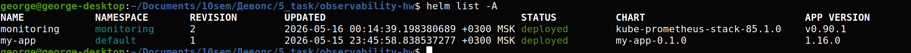
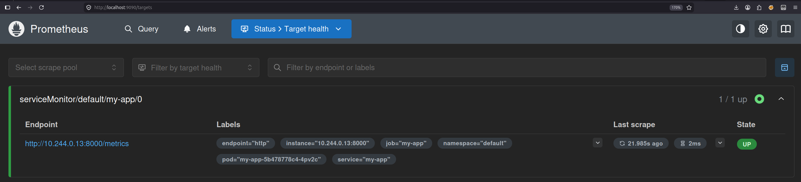
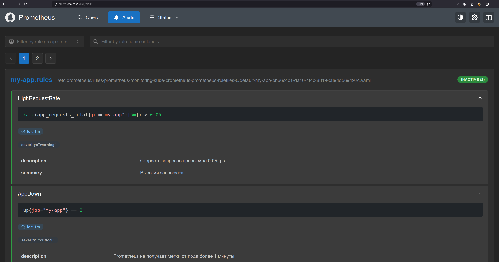
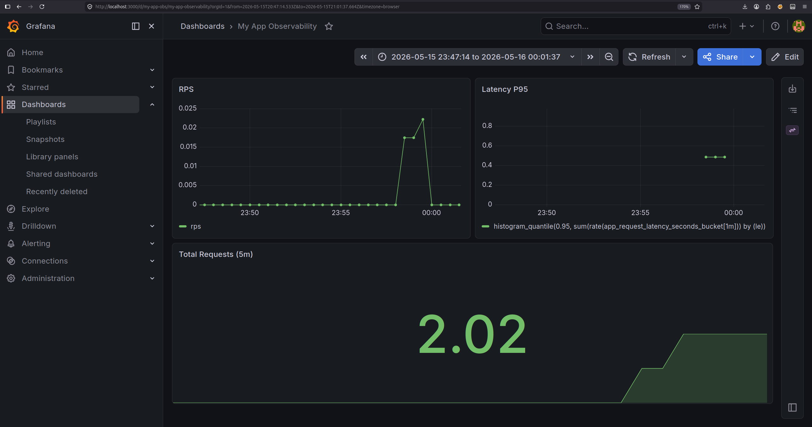

# Observability, вариант 2 (Helm)

## Описание
Развёртывание production-ready стека observability в локальном Kubernetes-кластере (kind) с использованием Helm. Включает автоматический сбор метрик приложения, мониторинг, алертинг и provisioning дашборда Grafana.

## Установка

1. Создайте кластер kind

   ```bash
   kind create cluster --name observability-hw
   ```

2. Соберите образ приложения и загрузите в кластер
   
   ```bash
   docker build -t my-app:latest app/
   kind load docker-image my-app:latest --name observability-hw
   ```

3. Установите kube-prometheus-stack

   ```bash
   helm repo add prometheus-community https://prometheus-community.github.io/helm-charts
   helm repo update
   helm install monitoring prometheus-community/kube-prometheus-stack -f monitoring-values.yaml -n monitoring --create-namespace
   ```

4. Задеплойте приложение

   ```bash
   helm install my-app ./helm/my-app
   ```

5. Откройте доступ к интерфейсам

   ```bash
   kubectl port-forward svc/monitoring-kube-prometheus-prometheus 9090:9090 -n monitoring &
   kubectl port-forward svc/monitoring-grafana 3000:80 -n monitoring &
   ```

   Prometheus UI: http://localhost:9090
   Grafana UI: http://localhost:3000 (логин: admin, пароль: admin123)
  
6. Сгенерируйте тестовый трафик

   ```bash
   kubectl run traffic-gen --rm -i --image=curlimages/curl --restart=Never -- sh -c 'for i in {1..50}; do curl -s http://my-app.default.svc.cluster.local; sleep 0.5; done'
   ```

## Примеры работы

### 1. Установленные Helm-релизы


### 2. Prometheus таргет состоянии UP


### 3. Prometheus Alerts


### 4. Grafana Dashboard

